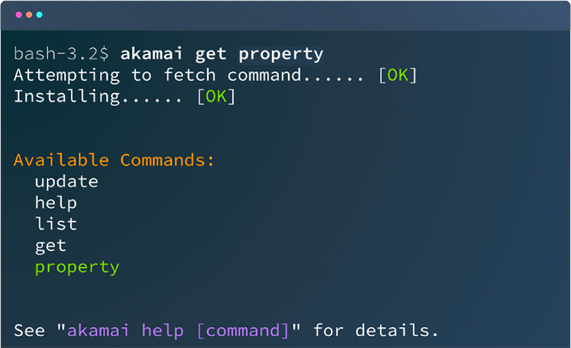

<h1 style="text-align: center">
  <br>
      
  <br>
</h1>

# Akamai CLI
[](https://goreportcard.com/report/github.com/akamai/cli) [](https://app.fossa.io/projects/git%2Bgithub.com%2Fakamai%2Fcli?ref=badge_shield)


Use Akamai CLI to configure Akamai platform and products directly from the command line. You can install ready-to-use product packages or build your own custom solutions to manage from CLI.

### Benefits

- Simple and task-oriented interface
- Consistent user experience across all Akamai products
- Wide range of supported packages and capabilities
- Extend or build your own CLI packages with supported programming languages such as Go, Python, and JavaScript

### Available Packages

Browse the list of [available packages](https://techdocs.akamai.com/home/page/products-tools-a-z?sort=cli).

## Install Akamai CLI

Akamai CLI doesn't have any dependencies and is quick to install. However, you may need an additional runtime for packages depending on the programming language they are based on.

Install Akamai CLI by downloading a [release binary](https://github.com/akamai/cli/releases). See instructions for various operating systems.

You can also use [Homebrew](#install-with-homebrew), [Docker](#install-with-docker), or compile from [source](#compile-from-source).

### System dependencies for Python-based packages

If you're using a Python-based CLI package, install these extra dependencies:

- Python 3.3 or above
- [Python 3 `pip` package installer](https://pip.pypa.io/en/stable/installation)
- [Python 3 `venv` module](https://docs.python.org/3/library/venv.html)
- Up-to-date common CA certificates for your operating system (PEM files)

### Install from binaries

Follow the instructions for your operating system.

#### Linux and macOS

Once you download the appropriate binary for your system, make it executable, and optionally make it available in your `$PATH`. Run the following commands:

```sh
$ chmod +x ~/Downloads/akamai-<VERSION>-<PLATFORM>
$ mv ~/Downloads/akamai-<VERSION>-<PLATFORM> /usr/local/bin/akamai
```

#### Windows

Once you download the appropriate binary for your system, simply execute the binary from the command line. For example:

```sh
$ akamai.exe help
```

### Install with Homebrew

You can also install Akamai CLI using the Homebrew package manager. If you haven’t used it before, check [Homebrew documentation](https://docs.brew.sh/Installation) for system requirements and read the installation guide.

Once set up, simply run:

```sh
$ brew install akamai
```

This command compiles and globally installs the binary with all necessary dependencies.

### Install with Docker

A container with Akamai CLI and pre-installed public packages is also available in [Docker](http://docker.com).
All images are built using Docker files from the [akamai-docker](https://github.com/akamai/akamai-docker) repository.
You can find all Akamai builds on [Docker Hub](https://hub.docker.com/u/akamai).

To start, create and run the container with Akamai Development Environment:

```sh
$ docker run -it -v $HOME/.edgerc:/root/.edgerc:ro akamai/shell
```

> **Note:** This mounts your local `$HOME/.edgerc` into the container. To change the local path, modify the `-v` argument.

The `akamai` command and basic packages are already installed. See the [akamai-docker](https://github.com/akamai/akamai-docker) repository for more details.

If you want to open Akamai Development Environment when calling the `akamai` command, add the following line to your `.bashrc`, `.bash_profile`, or `.zshrc` files:

```sh
alias akamai='docker run -it -v $HOME/.edgerc:/root/.edgerc:ro akamai/shell'
```

If you want to use a local `.akamai-cli` directory to configure and manage your installed packages, modify the `-v` argument:

```sh
$ docker run -it -v $HOME/.akamai-cli:/cli/.akamai-cli akamai/shell
```

This command installs the CLI and persists the configuration and packages in `$HOME/.akamai-docker` directory.

### Compile from Source

**Prerequisite:** Make sure you install Go 1.14 or later.

To compile Akamai CLI from source:

1. Change the working directory:

    ```sh
    $ cd $GOPATH
    ```

2. Fetch the package:

    ```sh
    $ git clone github.com/akamai/cli
    ```

3.  Go to the package directory:

    ```sh
    $ cd cli
    ```

4. Compile the binary:  

  - For Linux, macOS, and other Unix-based systems, run: `go build -o cli/main.go`
  - For Windows, run: `go build -o akamai.exe cli/main.go`

5. Move the `akamai` or `akamai.exe` binary so that it's available in your `$PATH`.

### API credentials

Akamai-branded packages use a `.edgerc` file for standard EdgeGrid authentication. By default, CLI looks for credentials in your `$HOME` directory.

You can override both the file location or the credentials section by passing the `--edgerc` or `--section` flags to each command.

To set up your `.edgerc` file, see [Get started with APIs](https://techdocs.akamai.com/developer/docs/set-up-authentication-credentials).

## Upgrade

Unless you installed Akamai CLI with Homebrew, you can enable automatic check for updates when you run Akamai CLI v0.3.0 or later for the first time.

When run for the first time, CLI asks you to enable automatic upgrades. If you do not agree, `last-upgrade-check=ignore` is set in the `.akamai-cli/config` file (this option will still allow you to perform manual upgrade as explained below). Otherwise, if a new version is available, CLI prompts you to download it. Akamai CLI automatically checks the new version's `SHA256` signature to verify it is not corrupt. After the update, your original command executes using the new version.

For information on manual upgrade and the supported Homebrew command, see `akamai upgrade` in [Built-in commands](#built-in-commands).

## How to use Akamai CLI

All CLI commands start with the `akamai` binary, followed by a command, and optionally an action or other arguments.

```sh
akamai [command] [action] [arguments...]
```

### Built-in commands

Use the following commands to manage packages and the toolkit:

- `help`

    `akamai help` shows basic usage info and available commands. To learn more about a specific command, run `akamai help <command> [sub-command]`.

- `list`

    `akamai list` shows a list of available commands. If a command doesn't display, ensure the binary is executable and in your `$PATH`.

- `install`

    This installs new packages from a git repository.

    `akamai install <package name or repository URL>` downloads and installs the command repository to the `$HOME/.akamai-cli` directory.

    For Github repositories, specify `user/repo` or `organization/repo`. For official Akamai packages, you can omit the `akamai/cli-` prefix. For example, to install `akamai/cli-property`, it's enough to run `property`.

    These examples all install Akamai CLI for Property Manager from Github using various aliases:

    ```sh
    akamai install property
    akamai install akamai/cli-property
    akamai install https://github.com/akamai/cli-property.git
    ```

    The `install` command accepts more than one argument, so you can install many packages at once using any of these types of syntax.

- `uninstall`

    To remove all the package files you installed with `akamai install`, run `akamai uninstall <command>`, where `<command>` is any command within that package.

    The `uninstall` command accepts more than one argument, so you can uninstall many packages at once.

- `update`

    To update a package you installed with `akamai install`, run `akamai update <command>`, where `<command>` is any command within that package.

    You can specify multiple packages to update at once.

    If you don't specify additional arguments, `akamai update` updates _all_ packages installed with `akamai install`

- `upgrade`

    Manually upgrade Akamai CLI to the latest version.

    If you installed Akamai CLI with Homebrew, run this command instead:

    ```sh
    $ brew upgrade akamai
    ```

- `search`

    Search all the packages published on [developer.akamai.com](https://techdocs.akamai.com/home/page/products-tools-a-z?sort=cli) for the submitter string. Searches apply to the package name, alias, and description. Search results appear in the console output.

- `config`

    View or modify the configuration settings that drive the common CLI behavior. Akamai CLI maintains a local configuration file in its root directory. The `config` command supports these sub-commands:
    - `get`
    - `set`
    - `list`
    - `unset` or `rm`

### Installed commands

This commands depend on your installed packages. To use an installed command, run `akamai <command> <action> [arguments]`, for example:

```sh
akamai property create example.org
```
For the list of supported commands, see the [documentation](https://techdocs.akamai.com/home/page/products-tools-a-z?sort=cli) for each package.

### Custom commands

Akamai CLI provides a framework for writing custom CLI commands. See the extended [Akamai CLI documentation](https://techdocs.akamai.com/developer/docs/about-clis) to learn how to contribute, create custom packages, and build commands.

Before you start to build your own commands, make sure you meet these prerequisites:

1. The package is available through a Git repository that supports standard SSH public key authentication.
2. The executable is named `akamai-<command>` using dashed-lowercase, or `akamai<Command>` using camelCase.
3. Verify that `akamai-command help` works for you. Ideally, CLI should allow for `akamai-command help <sub-command>`.
4. If you're using Akamai APIs, the executable must support the `.edgerc` format, and must support both `--edgerc` and `--section` flags.
5. If an action fails to complete, the executable exits with a non-zero status code.

As long as the result is executable, you can use any of the supported languages to build your commands, including Python, Go, and JavaScript.

### Logging

To see additional log information, prepend `AKAMAI_LOG=<logging-level>` to any CLI command. You can specify one of the following logging levels:

- `fatal`
- `error`
- `warn`
- `info`
- `debug`

For example, to see extra debug information while updating the property package, run:

```sh
AKAMAI_CLI_LOG=debug akamai update property
```

Each level is a progressive superset of all previous tiers. The output for `debug` also includes `fatal`, `error`, `warn`, and `info` logs.

If you want to redirect logs to a file, use the `AKAMAI_CLI_LOG_PATH` environmental variable:

```sh
AKAMAI_CLI_LOG=debug AKAMAI_CLI_LOG_PATH=akamai.log akamai update property
```

## Dependencies

Akamai CLI supports the following package managers that help you automatically install package dependencies:

- Python: `pip` (using `requirements.txt`)
- Go: `go modules`
- JavaScript: `npm` and `yarn`

If you want to use other languages or package managers, make sure you include all dependencies in the package repository.

## Command package metadata

The package you install needs a `cli.json` file. This is where you specify the command language runtime version and define all commands included in package.

### Format

- `requirements`: Specifies the runtime requirements. You may specify a minimum version number or use the `*` wildcard for any version. Possible requirements are:
  - `go`
  - `node`
  - `python`

- `commands`: Lists commands included in the package.
  - `name`: The command name, used as the executable name.
  - `aliases`: An array of aliases that invoke the same command.
  - `version`: The command version.
  - `description`: A short description for the command.
  - `bin`: A URL to fetch a binary package from if it cannot be installed from source.

    The `bin` URL may contain the following placeholders:

    - `{{.Version}}`: The command version.
    - `{{.Name}}`: The command name.
    - `{{.OS}}`: The current operating system, either `windows`, `mac`, or `linux`.
    - `{{.Arch}}`: The current OS architecture, either `386` or `amd64`.
    - `{{.BinSuffix}}`: The binary suffix for the current OS: `.exe` for `windows`.

### Example

```json
{
  "requirements": {
    "go": "1.8.0"
  },
  "commands": [
    {
      "name": "purge",
      "version": "0.1.0",
      "description": "Purge content from the Edge",
      "bin": "https://github.com/akamai/cli-purge/releases/download/{{.Version}}/akamai-{{.Name}}-{{.OS}}{{.Arch}}{{.BinSuffix}}"
    }
  ]
}
```
## Akamai CLI exit codes

When you complete an operation, Akamai CLI generates one of these exit codes:

- `0` (Success) - Indicates that the latest command or script executed successfully.
- `1` (Configuration error) - Indicates an error while loading `AKAMAI_CLI_VERSION` or `AKAMAI_CLI`.
- `2` (Configuration error) - Indicates an error while creating the `cache directory`.
- `3` (Configuration error) - Indicates an error while saving the `cache-path`.
- `5` (Application error) - Indicates an error with the initial setup. Occurs when you run Akamai CLI for the first time.
- `6` (Syntax error) - Indicates that the latest command or script cannot be processed.
- `7` (Syntax error) - Indicates that the commands in your installed packages have conflicting names. To fix this, add a prefix to the commands that have the same name.
